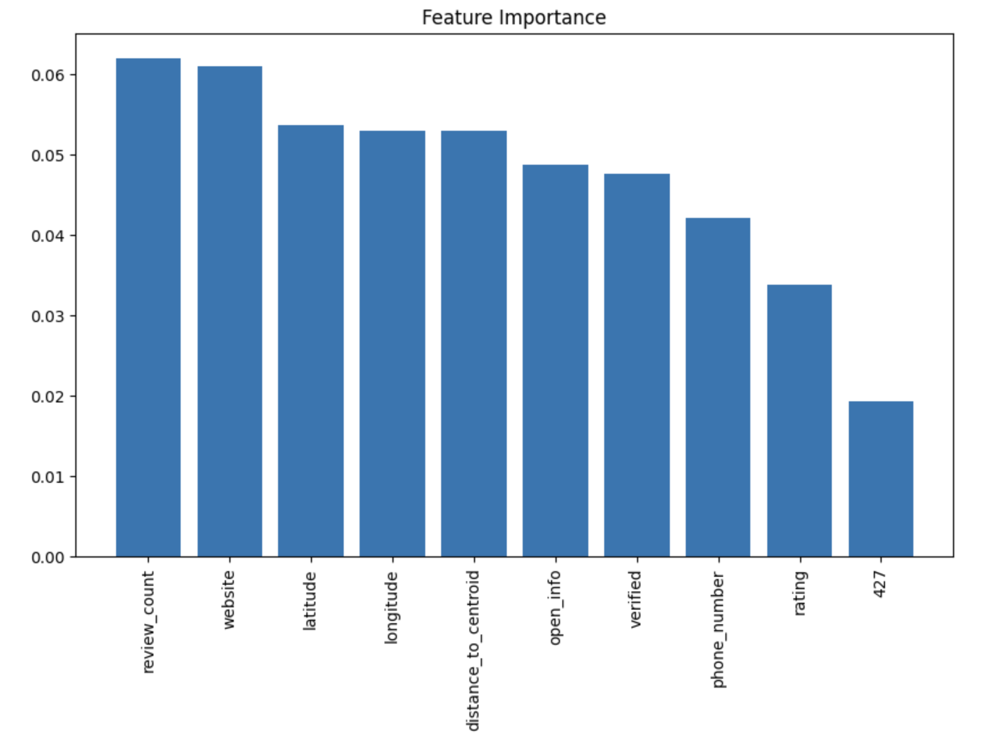
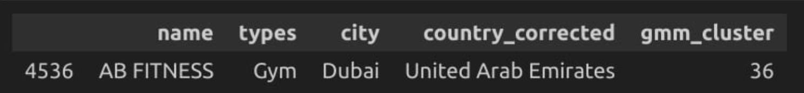
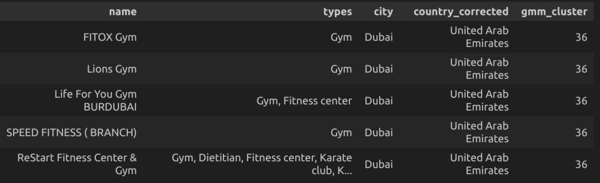
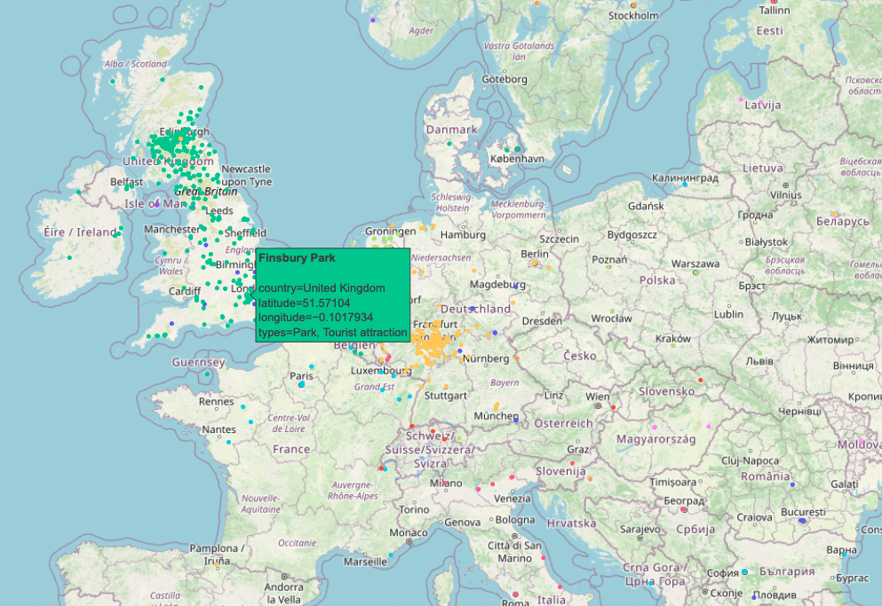

# Google-Places-Clustering

This project was conducted as part of the Machine Learning course at Warsaw University of Technology.

## Goal
In this project we aimed to apply Unsupervised Learning techniques for clustering. The primary goal was to uncover hidden patterns among Google places using Location Intelligence dataset from kaggle. The business case involved builiding a recommendation system that accurately suggests similar Google Businesses based on one sample.

## Source Dataset
For the purpose of this project, we used dataset that can be found at [kaggle.com](https://www.kaggle.com/datasets/azharsaleem/location-intelligence-data-from-google-map). It has been meticulously scraped from Google Maps by the author Azhar Saleem and presents extensive information about 15 000 businesses across several countries.

## Technologies
- Python
- Libraries: sklearn, geopy, sentence_transformers, pandas, numpy, plotly, matplotlib, seaborn

## Scope of the project
The project encompassed the following stages:
1. Exploratory Data Analysis (EDA): Understanding the dataset and identifying patterns.
2. Feature Engineering (FE): Transforming and creating new features to improve model performance. Eliminating errors resulting from faulty web scraping.
3. Model Building: Employing various clustering algorithms and hyperparameter tuning for optimal performance.
4. Interpretation of the results: Alalysing feature importances and building a recommendation system.

## Results
In our Google Places Clustering project, we evaluated HDBSCAN, DBSCAN, KMeans, and Gaussian Mixture Model (GMM). The GMM model performed the best, as evidenced by t-SNE visualizations and manual cluster analysis.

- **DBSCAN**: Performed the worst, assigning nearly all points to one cluster.
- **HDBSCAN**: Identified many points as outliers.
- **KMeans**: Better than DBSCAN, but not as effective as GMM.
- **GMM**: Produced the most meaningful clusters.

### Feature Importance

Using a Random Forest model, we identified the key features for predicting cluster labels:
- **review_count**
- **website** (presence or absence)
- **longitude and latitude**

  
  
Figure 1: Key features that allow to distinguish between clusters.

### Recommendation System

We built a recommendation system that takes a single Google Place and recommends five similar places from the same cluster, sorted by proximity. The system has been tested and performs well.

  

    
    
Figure 2: Sample row.

  

  

    ➡️
  

  

    
    
Figure 3: Recommendations for the given Google place.

  

  
  
Figure 4: Map of the Google Places included in the dataset with additional information.

## Repository contents
The repository contains the following key files and directories:
- `data/`: Directory containing the dataset files used in the project.
- `google_places_EDA.ipynb`, `google_places_FE_v1.ipynb`, `google_places_FE_v2.ipynb`, `google_places_final_models.ipynb`: Jupyter notebooks with code for data exploration, feature engineering, model building, and evaluation. Note that `google_places_FE_v1.ipynb` contains the first ideas for Feature Engineering that have been abandoned afterwards and replaced with what has been done in `google_places_FE_v2.ipynb`. The file is only kept for comparison.
- `validation_EDA.ipynb`: Jupyter notebook containing data exploration on the validation set.
- `map_general.html`, `map_specific_info.html`: Interactive visualisations of the data points.
- `autoEDA_summary.html`: EDA report that has been generated using autoML libraries.

## Authors
- Hubert Kowalski
- Mateusz Iwaniuk
